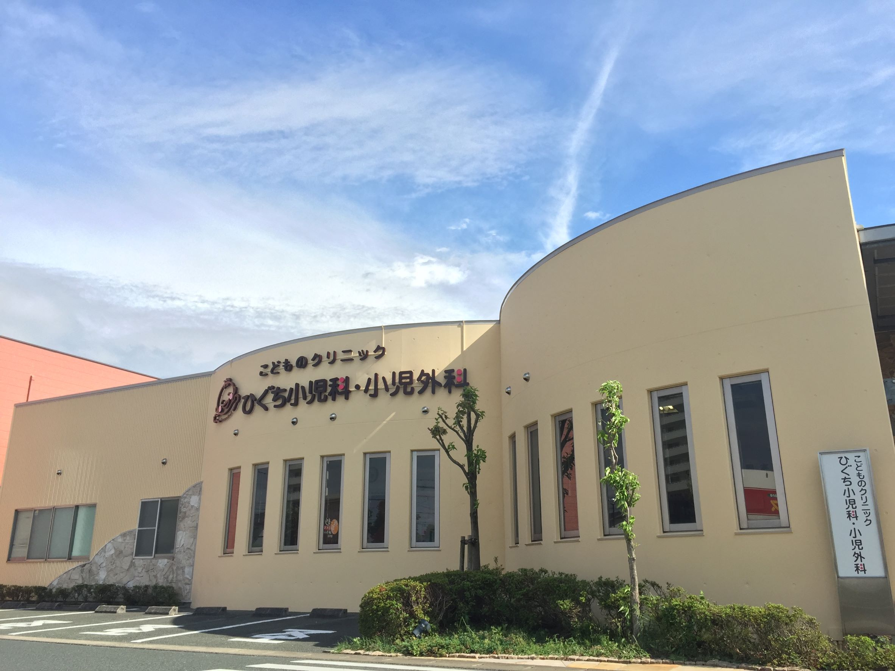

# ひぐち小児科・小児外科  

  
***
  
## ＜当院での新型コロナワクチン接種について(第3報)＞  
熊本市の新型コロナワクチン第7期配布分について、当院での接種予約受付を以下のように行います。  
対象：満12歳から15歳までの当院かかりつけの方  
1回目接種日：10月16日(土)  
2回目接種日：1回目接種予約時に3週後の11月6日(土)同時間の予約をお取りします。  
ワクチン種類：ファイザー社製  
予約受付開始日：9月25日(土)午前8時30分から  
予約方法：当院電話(096-331-0021)にて受け付けます。  
＊熊本市から当院へのワクチン配分量が決められておりますので、予約枠には限りがあります。  
＊限られたワクチンを有効活用するため、体調不良以外でのキャンセルはないようにお願いします。  
＊最近、二種混合ワクチンや日本脳炎ワクチンなどの定期のワクチンを接種された方は、2週間以上の間隔をあけて新型コロナワクチンを接種する必要があります。予約時に申し出て下さい。  
(2021.09.12 記載)  
  
***  
  
## 医院情報  
***  
### ひぐち小児科・小児外科  
〒862-0918  
熊本県熊本市東区花立5丁目9-16  
TEL　096-331-0021  
院長　樋口 章浩  
日本小児科学会　　小児科専門医  
日本小児外科学会　小児外科専門医  
  
***  
  
当院ホームページ  
[https://higuchi-shounika.com/](https://higuchi-shounika.com/)  

***  

小児科・小児外科医療を通して  
地域の子供達の健康管理に努めていきたいと思います。  
まごころを込めた医療を心がけます。  
携帯電話・パソコンから順番取り可能(再来院から)  
  
---  
  
●●診療科目●●  
小児科・小児外科  

●●受付時間●●  
午前　月～土　9:00～12:00（木は11：00までの日有り）  
午後　月・火・水・金 15：00～18：30  
土 14：00～16：00  

休診日　日曜・祝日・木曜午後  
※夜間は受け付けておりません。  
※土曜日は16：00までです。  
※木曜日は11：00までの受付となる場合もございますので  
御注意下さい。  

---  

●●乳児健診・予防接種●●  

月・火・水・金　ＰＭ２：００～３：００(予約制)  

生後2ヶ月になったら予防接種を始めましょう。  
スケジュールについては、ご相談下さい。  

予防接種の種類  
●三種混合　●四種混合　●MR（はしか、風疹混合）  
●日本脳炎　●二種混合　●インフルエンザ  
●おたふくかぜ　●水痘　●ヒブ　●Ｂ型肝炎  
●ロタウイルス●肺炎球菌　●不活化ポリオワクチン  

※予防接種に関して、熊本県予防接種広域化制度があります。  
熊本市以外の市町村の方も、当院で、定期の予防接種を受けることができます。  
※乳児健診・予防接種は、予約制となっております。  
※上記の時間帯以外でも、乳児健診・予防接種は受け付けています。  
その場合、診察の進み具合によりお待ち頂く事もございますので
予め御了承ください。  
  
___  
  
※当院は院内処方で薬をお出ししております。  

___  

●小児科一般診療  
●小児外科疾患に関する相談、診察、治療  
（鼠径ヘルニア・停留精巣・[臍ヘルニア](heso.md)など）  
●こどもの手術に関する相談  
●[医師会病院オープンシステムを用いた小児外科手術](shujutsu.md)  
（*鼠径ヘルニア*、*臍ヘルニア*、*停留精巣*など）  

●臍ヘルニア圧迫療法  

●**小児便秘症**  
- 相談  
- 診察  
- 治療  

★携帯電話・パソコンから順番取り可能 (再来院から)  
初診は不可  

★車椅子のまま診察室に入れます。  
★プレイルーム有り  
  
***  
  
当院ホームページ  
[https://higuchi-shounika.com/](https://higuchi-shounika.com)  
  
***  
<https://higuchi-shounika.com/>  
`https://higuchi-shounika.com`  
  